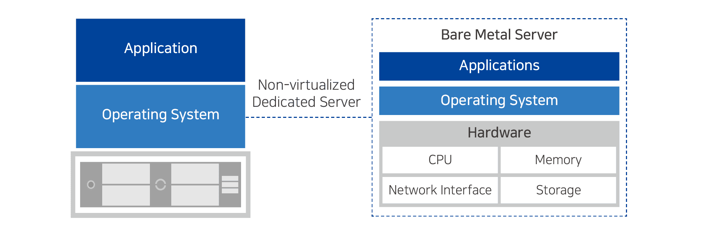
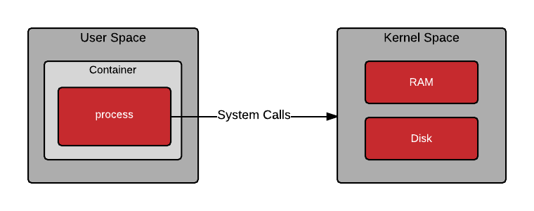
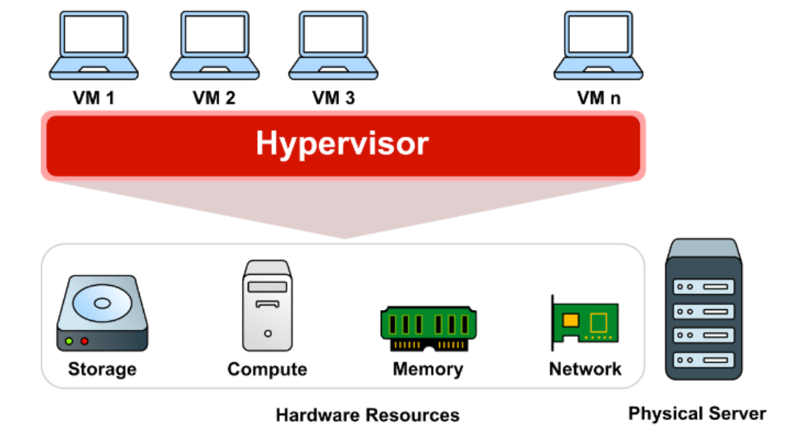

# 🖥️ Docker Architecture: Bare Metal, Virtual Machines & Containers

## Bare Metal

### What is Bare Metal?

A **bare metal system** is a physical computer or server running without any virtualization layer.

- The operating system runs **directly** on the hardware.
- No hypervisor or virtual machine is involved.
- Resources (CPU, RAM, disk) are used **entirely** by one system.

### Advantages

- Maximum performance
- Full hardware control
- Low latency, ideal for demanding applications (games, databases…)

### Disadvantages

- Less flexibility (no multi-OS)
- Harder to backup or migrate
- Higher cost due to lack of resource sharing

---

## Containers

### What is a Container?

A **container** is a lightweight, isolated environment for running applications.

- Shares the **host OS kernel**
- Starts fast, uses fewer resources
- Isolated at **process level** (not hardware level)

### Kernel & Containers

| Concept                    | Description                                                                 |
|----------------------------|-----------------------------------------------------------------------------|
| **Host Kernel**            | Containers share the host OS's kernel                                       |
| **No kernel inside**       | Containers do **not** include their own kernel                              |
| **Same kernel required**   | Container must match host kernel type (Linux vs Windows)                    |
| **Linux host**             | Runs Linux containers natively                                              |
| **Windows host**           | Runs Windows containers or Linux containers via Hyper-V                     |
| **Isolation level**        | Process-level isolation, unlike VMs which are hardware-level                |

---

## Virtual Machines (VMs)

### What is Virtualization?

**Virtualization** allows multiple operating systems to run on a single physical machine via **virtual machines (VMs)**.

### What is a Virtual Machine?

A **VM** is a software-emulated computer created by a **hypervisor**. It behaves like a real machine, with its own CPU, RAM, storage, and OS.

- The **host** is your physical machine
- The **hypervisor** manages VMs (e.g., VirtualBox, VMware)
- The **guest** is the VM running inside the host

### Advantages

- Run multiple OSes on one machine
- Ideal for testing and sandboxing
- Easy to back up, move, or delete
- Cost-efficient in enterprise settings

### Disadvantages

- Each VM needs a full OS → heavy resource usage
- Slow to boot
- Less efficient than containers for lightweight tasks

---

## Comparison Summary

| Feature              | Bare Metal            | Virtual Machine                  | Container                     |
|----------------------|------------------------|----------------------------------|-------------------------------|
| Startup Time         | Fast                   | Slow                             | Very Fast                     |
| Resource Efficiency  | High                   | Low                              | Very High                     |
| OS Isolation         | N/A                    | Full OS per VM                   | Process-level                 |
| Kernel Shared        | N/A                    | No                               | Yes                           |
| Portability          | Low                    | Medium                           | High                          |
| Use Case             | High-performance apps  | Testing, multiple OS, isolation  | Microservices, fast deploy    |

