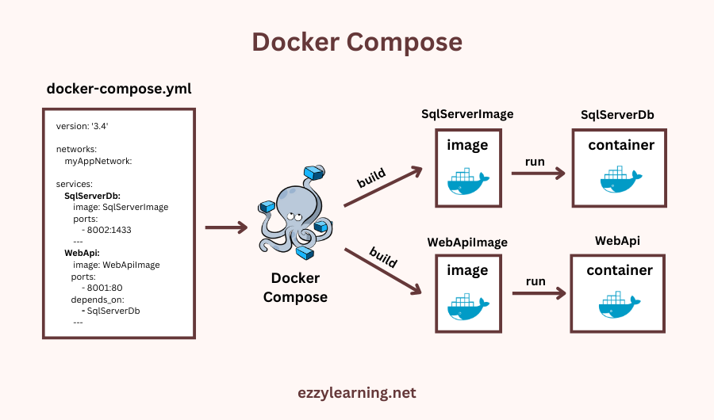

# Docker Compose

  
_Tool for building and running multi-container applications with one command. It manages interaction and networking between containers and their ports._

## docker-compose file (yml)

## 1. Services

_It's a definition of a Docker container configuration within the docker-compose.yml file. It specifies which Docker image to use, dockerfile location , and the container’s runtime settings (ports, volumes, environment variables, networks). Each service corresponds to one or more containers running the same configuration._

```yml
services:
    frontend:
        build: ./web # Path to the Dockerfile for the frontend
        ports:
            - <host_port>:<container_port>
    backend:
        build: ./api # Path to the Dockerfile for the api
        ports:
            - <host_port>:<container_port>
    database:
        image: postgres:<version> # build the image for db
            - <host_port>:<container_port>
```

## 2. Configuration instructions

| Key              | Description                                                      |
| ---------------- | ---------------------------------------------------------------- |
| `build`          | Path or configuration to build a Docker image from a Dockerfile. |
| `image`          | Specify the image to use for the container.                      |
| `container_name` | Assign a custom name to the container.                           |
| `command`        | Override the default command.                                    |
| `entrypoint`     | Override the default entrypoint.                                 |
| `ports`          | Map host ports to container ports (`HOST:CONTAINER`).            |
| `expose`         | Expose ports to linked services without publishing to the host.  |
| `volumes`        | Mount volumes .                                                  |
| `environment`    | Set environment variables.                                       |
| `depends_on`     | Define service dependencies (startup order).                     |
| `networks`       | Connect the service to specified networks.                       |
| `working_dir`    | Set the working directory inside the container.                  |

## Commands

| Command                                  | Description                                                           |
| ---------------------------------------- | --------------------------------------------------------------------- |
| `docker-compose up`                      | Starts all the services defined in the file.                          |
| `docker-compose down`                    | Stops and removes all containers associated with the Compose project. |
| `docker-compose build`                   | Builds or rebuilds the service images.                                |
| `docker-compose ps`                      | Displays the status of running containers.                            |
| `docker-compose run <service> <command>` | Runs a one-off command in a new container of a specific service.      |
| `docker-compose logs`                    | Shows the logs of running services.                                   |
| `docker-compose stop`                    | Stops the containers without removing them.                           |
| `docker-compose restart`                 | Restarts all running services.                                        |
